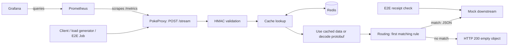

# PokeProxy — Production-Ready DevOps Take-Home

PokeProxy validates HMAC-signed Pokémon protobuf messages, applies routing rules,
and forwards matching data as JSON. This submission adds application hardening,
reproducible Kubernetes deployment, CI/GitOps delivery, real-traffic verification
and monitoring. **Production readiness is the engineering goal; the deployed stack
is a local assignment environment, with explicit limitations below.**

## At a glance

| Area | Implementation |
| --- | --- |
| Kubernetes | Single-node kind cluster |
| Deployment | Kustomize manifests; Make/Python orchestration |
| CI | GitHub Actions; lint, tests, builds and configuration validation |
| CD / GitOps | Promotion PR updates Git; explicit local reconciler applies and verifies |
| Monitoring | Prometheus + Grafana; dashboard and alert rules in Git |
| Cache | Redis, used as a best-effort decoded-data cache |
| Bootstrap / access / verification | `make up` / `make tunnels` / `make verify` |

**Review path:** this guide → [rollback runbook](docs/rollback.md) →
[alert rationale](docs/alerts.md). Detailed decisions and evidence are indexed in
[planning](docs/planning/README.md).

## Architecture



HMAC is checked **before** Redis. Cache hits skip decoding but still forward;
Redis is not delivery deduplication. Rule conditions use AND, with the first match
winning. Downstream attempts have bounded deadlines and no automatic POST retry.

## Quick Start

### Prerequisites

- **Linux**, Docker Engine with Buildx, running and accessible to your user.
- **2 CPUs / 4 GiB RAM** available to Docker; roughly **10 GiB disk** recommended.
- GNU Make, Bash, Python **3.11+**, standard utilities including `timeout` and `flock`.
- kind **v0.33.0**, kubectl **1.36.x**; internet access for uncached downloads.

If the Kubernetes CLIs are missing, explicitly run `make tools` (requires curl,
sha256sum and install). It downloads checksum-verified binaries into `.local/bin`.
No command installs system packages or uses sudo. `make doctor` checks prerequisites.
Host uv, Redis and application Python packages are not needed for bootstrap.

### Deploy and open local access

From the repository root:

```bash
make up
make tunnels
```

`make up` creates/starts kind, builds and loads application images, preloads pinned
Redis/monitoring images through host Docker, preserves local credentials, deploys
all five workloads, waits for readiness and runs application/monitoring gates.
It is safe to rerun and **does not start background tunnels**.

`make tunnels` starts three localhost-only background port-forwards, checks HTTP
readiness and returns your terminal. Repeated calls reuse healthy managed processes.

| Service | URL |
| --- | --- |
| Grafana health dashboard | http://127.0.0.1:3000/d/pokeproxy-health — Viewer, no login |
| Prometheus | http://127.0.0.1:9090 |
| Targets / alerts | http://127.0.0.1:9090/targets · http://127.0.0.1:9090/alerts |
| PokeProxy readiness / health | http://127.0.0.1:8000/ready · http://127.0.0.1:8000/health |
| Application metrics / statistics | http://127.0.0.1:8000/metrics · http://127.0.0.1:8000/stats |

Logs and process records live in `.local/tunnels/{proxy,prometheus,grafana}.{log,pid}`.
Occupied ports fail clearly; unrelated processes are left alone. If a rollout
interrupts access, rerun `make tunnels`. Foreground helpers `make proxy`,
`make prometheus` and `make grafana` remain available; do not run them on the same
ports as managed tunnels.

## Verification

```bash
make status
make verify
curl -fsS http://127.0.0.1:8000/ready
curl -fsS http://127.0.0.1:9090/-/ready
```

**`make verify` proves delivery, not just HTTP availability.** A bounded Kubernetes
Job signs a fixed matching protobuf payload, sends it twice through the PokeProxy
Service, and verifies exact Pokémon JSON, routing reason and unique correlation
IDs in mock receipts. It checks authenticated Redis/cache reuse and application
metrics. The monitoring gate checks scraping, traffic metrics, alert rules,
Grafana provisioning and its datasource. Failure exits non-zero.

With uv installed, `make lint` and `make test` run developer checks. For 60 seconds
of synthetic traffic plus an intentional HMAC rejection:

```bash
uv run --frozen python scripts/verify_monitoring.py \
  --context kind-pokeproxy --kubeconfig .kube/kind-config
```

### Recorded evidence

| Check | Observed result |
| --- | --- |
| Fresh-cluster bootstrap, then repeated `make up` | Passed; five workload Pod UIDs unchanged on rerun |
| Subsequent registry-DNS failure recovery | Host image preload restored Redis; `make up` passed both gates |
| Tunnel start / second start | Three HTTP checks passed; same PIDs reused |
| Tunnel shutdown / repeated shutdown | Passed; all three ports closed and PID records removed |
| Application/delivery/monitoring evidence | [Phase records](docs/planning/README.md), [monitoring result](docs/verification/part-4.json) |

Exact tunnel commands/results and regression counts are in
[tunnel verification](docs/verification/tunnels.md). **Hosted Actions publication,
GHCR push and promotion PR creation were not executed here.** Their local equivalents
and delivery failure/recovery were tested; see [CI/CD evidence](docs/planning/04-cicd-gitops.md).

## Teardown and useful commands

```bash
make tunnels-down
make down
```

Tunnel cleanup checks recorded process identity, stops only checkout-managed
port-forwards and removes stale PID files. Cluster teardown deletes the named
`pokeproxy` kind cluster and ephemeral data; credentials, logs, tools and Docker
caches remain. `make down` does not manage tunnels—stop them explicitly as above.

| Command | Purpose |
| --- | --- |
| `make help` / `make doctor` | Discover targets / check prerequisites |
| `make status` / `make logs` | Workload and managed tunnel status / follow proxy logs |
| `make build` | Build proxy/mock images |
| `make verify` | Repeat application and monitoring gates |
| `make tunnels` / `make tunnels-down` | Open / close managed local access |

## Application hardening

The [issue records](docs/issues/README.md) explain each defect, fix and test:

- Bounded uploads, responses, concurrency, dependency timeouts and shutdown.
- Pooled HTTP connections, correct framing and header/cookie isolation.
- Direct Redis lookup, cache validation and nonfatal bounded cache failures.
- Startup validation of routing/HMAC settings and compatible protobuf dependencies.
- Bounded metrics, consistent accounting, safe structured logs and correlated receipts.

Rules load at startup; changes require a rollout. `/health` checks the process;
`/ready` checks initialization and reports the last cache-operation state, not a
continuous connectivity probe. Dependency outages do not fail liveness.
See [hardening decisions](docs/planning/02-production-hardening.md),
[environment settings](.env.example) and [deployment budgets](deploy/base/pokeproxy.env).

## Containers and Kubernetes

The [multi-stage Dockerfile](Dockerfile) uses digest-pinned Python/uv and locked
runtime dependencies, producing separate proxy/mock targets running as UID 10001.
Each uses one Uvicorn worker with finite shutdown budgets. Dependency layers are
cached independently of source changes.

[Kustomize manifests](deploy/base/) deploy proxy, mock and Redis into `pokeproxy`;
Prometheus/Grafana run in `monitoring`. ClusterIP Services keep access internal.
Workloads have resource budgets, probes and security contexts: non-root execution,
read-only root filesystems, dropped capabilities and no privilege escalation.
Prometheus has scoped discovery RBAC; application Pods do not mount API tokens.
Configuration hashes trigger rollouts. Secrets stay outside Git.

Local images use content-derived tags and kind loading. Release images use
source-SHA/run/attempt tags **plus registry digests**. Storage is ephemeral; there
is no ingress, TLS termination or enforced NetworkPolicy in this demo.
[Infrastructure rationale](docs/planning/03-local-deployment.md).

## CI pipeline

[GitHub Actions](.github/workflows/ci.yml) performs:

1. Checkout and configure pinned Python/uv; restore dependency cache.
2. Ruff and pytest, including real Redis and HTTP-process checks.
3. Build wheel/source distribution; validate workflows, shell, Kubernetes schemas,
   Prometheus rules and dashboard JSON, including alert-rule scenarios.
4. Build both container targets with BuildKit caches.
5. On default-branch pushes, publish GHCR images tagged
   `sha-<full-sha>-<run-id>-<attempt>` and upload digest-bearing `release.json`.

Actions are commit-pinned. Scoped `GITHUB_TOKEN` references supply credentials;
there are no literal credentials in workflow YAML. PR/manual builds do not publish.

## CD / GitOps and rollback

**CI produces artifacts → promotion updates Git → reconciliation deploys.**

The separate [promotion workflow](.github/workflows/promote.yml) validates a successful
CI run and opens a PR changing `deploy/overlays/release`. After review and merge:

```bash
git fetch origin
python3 scripts/reconcile.py deploy --context kind-pokeproxy \
  --kubeconfig .kube/kind-config --revision origin/main
```

Use the actual default branch. The release overlay is initially a placeholder;
first promote real images. Provision application Secrets and registry access
outside Git. GitHub must allow Actions-created PRs; those PRs need the documented
manual check trigger. [Setup and release instructions](docs/planning/04-cicd-gitops.md).

The reconciler applies a committed snapshot, waits and runs the E2E gate. It records
the last verified Git revision and image digests. On a later deployment failure it
restores and re-verifies that snapshot, **still returning failure for the attempted
release**. A Git revert/fix makes recovery durable; first-release failure has no
fallback. Secrets, data and downstream side effects are not rolled back, and
obsolete resources are not pruned. [Rollback runbook](docs/rollback.md).

Argo CD is not installed. It would replace the explicit local reconciler, watch the
same overlay and run verification as a PostSync hook. That hook alone would not
create a Git revert. Do not run competing writers. `make up` uses the working tree,
does not perform release rollback and refuses a cluster with recorded GitOps state.

## Observability

| Signal | Meaning |
| --- | --- |
| Request counters | Received/completed handlers and outcomes, including HMAC/input rejection |
| Routing/forwarding counters | First matches and downstream success/failure |
| Cache counters | Hits, misses, reads/writes and errors |
| Histograms | Handler and downstream latency; handler duration excludes response transmission |
| Gauges/process metrics | Admitted in-flight work, process CPU/RSS |

Labels use bounded outcomes/statuses/rule indices, never payloads or request IDs.
[Prometheus](deploy/monitoring/prometheus/) scrapes proxy Pods. The
[17-panel Grafana dashboard](deploy/monitoring/grafana/pokeproxy.json) shows traffic,
failures, latency, cache behavior and scrape/process health.

[Five alerts](docs/alerts.md) cover unavailable scraping, forwarding failures, server
errors, slow processing and cache errors. Each documents thresholds, windows and
operator action. Individual invalid signatures, normal misses and unmatched
messages deliberately do not page. Alertmanager/notifications and whole-cluster
resource monitoring are not installed.

## Security, trade-offs and limitations

| Local choice / limitation | Production direction |
| --- | --- |
| Generated private local credentials; Kubernetes Secrets | Managed secret delivery/rotation and encryption policy |
| Anonymous Grafana Viewer, localhost tunnels, plaintext cluster traffic | Operator authentication, TLS and enforced network boundaries |
| One node, one replica, ephemeral storage | Resilient cluster, measured capacity, appropriate persistence and disruption policy |
| HMAC without replay protection; no automatic POST retries | Explicit downstream idempotency and replay contract |
| Best-effort Redis decode cache | Availability sized to cache semantics; trusted/restricted writers |
| Manual reconciliation, host-local lock, no pruning | One continuous controller, retained audit history and reviewed rollback policy |
| Demonstration alert thresholds | Measured SLOs, notification routing and independent monitoring |

A timeout may follow downstream acceptance, so caller retries can duplicate side
effects. Mock receipts are bounded and process-local; one E2E route is not full
route coverage or a throughput test. Metrics omit server-level rejection before
the handler; process RSS is not Pod resource coverage.

The public `.env.example` key is for native development only. Bootstrap generates
its own credentials and refuses silent rotation. Base64-encoded Secrets are not
inherently encrypted. Logs omit payloads, signatures and credential values.

Linux x86_64 was tested; ARM64, a pristine OS and stopped-node recovery were not
separately exercised. Bootstrap tests retained Docker caches/local credentials.
Live rollback tests changed configuration using the same images; other failure
branches have unit coverage. Future priorities are realistic load/route coverage,
supply-chain scanning/signing, production networking/secrets and continuous Git
reconciliation—not additional local infrastructure for its own sake.

## Repository and implementation process

| Path | Contents |
| --- | --- |
| `src/pokeproxy/`, `mock_service/`, `proto/` | Application, mock and schema |
| `tests/`, `scripts/`, `Makefile` | Regression coverage, verification and operational entry points |
| `infra/kind/`, `deploy/` | Cluster, application/monitoring manifests and release overlays |
| `.github/workflows/` | CI and desired-state promotion |
| `docs/issues/`, `docs/planning/`, `docs/verification/` | Findings/fixes, decisions and recorded evidence |

Development was **AI-assisted** through interactive repository analysis,
implementation, testing and documentation. The [chronological planning index](docs/planning/README.md)
links phases 01–06 and summarizes prompt categories, including final review.
Historical assessments describe their point in time; recorded checks distinguish
what ran locally from untested remote operations.
