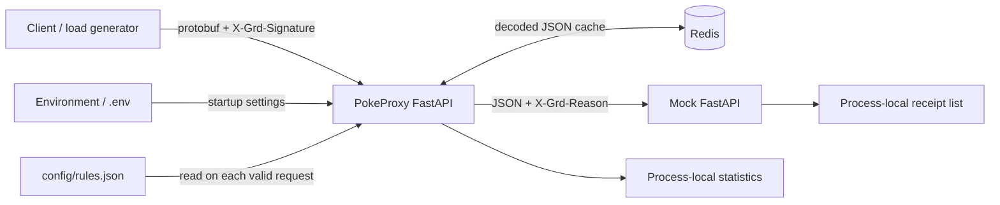

# PokeProxy initial assessment

Assessment date: 2026-09-16. Baseline: commit `4df978d` (`Initial app fixes`).
Scope: discovery only; this document is the only new deliverable in this pass.
No application, test, configuration, dependency, or deployment behavior was changed.

## Evidence and scope

Read all tracked application modules, generated protobuf Python/stub files,
protobuf schema, mock service, both scripts, both test modules, package markers,
README, configuration, environment example, ignore rules, Python version,
package metadata, dependency lock, existing planning/issue/verification documents,
and the six-page assignment PDF. Inspected the repository inventory and Git state.
There are no repository AGENTS.md instructions; `.agents` and `.codex` are empty.
Installed dependencies, caches, and Git internals are not application source.

The working tree was clean at discovery start. The former `me.txt` is absent
from this snapshot. Earlier documents reference ELK; the current user request
specifies **Prometheus/Grafana**, which governs this proposed plan. Earlier text
saying the repository is uninitialized, all tests are blocked, or only five tests
exist is historical. The secret and protobuf fixes are already present.

Findings below are source-based unless explicitly attributed to the previous
verification record. No services, tests, deployment, benchmark, vulnerability
scan, or failure-injection experiment was run in this discovery pass. Existing
verification reports 15 passing tests in the locked environment and an isolated
protobuf-minimum environment; that is prior evidence, not a new run.

## A. Repository architecture

| Path | Current responsibility |
| --- | --- |
| `src/pokeproxy/main.py` | FastAPI app, lifespan, `/health`, `/stats`, `/stream` router registration |
| `src/pokeproxy/config.py` | Environment settings, secret validation, models, protobuf-to-model conversion |
| `src/pokeproxy/proxy.py` | Body handling, HMAC, cache orchestration, routing, HTTP forwarding, statistics |
| `src/pokeproxy/cache.py` | SHA-256-derived cache keys, Redis decoded-JSON reads/writes, 300-second TTL |
| `src/pokeproxy/rules.py` | Parse typed conditions, load JSON rules, AND matching, first rule wins |
| `src/pokeproxy/stats.py` | Per-process, per-destination counters and retained latency samples |
| `proto/pokemon.proto` | One proto3 `pokedex.Pokemon` message, 14 scalar fields |
| `src/pokeproxy/proto/` | Checked-in generated Python message and type stub; no runtime compilation |
| `mock_service/main.py` | Separate FastAPI receiver and in-memory receipt inspection/reset endpoints |
| `scripts/load_generator.py` | Sequential, signed synthetic traffic from 12 sample Pokemon |
| `scripts/generate_proto.sh` | Isolated grpcio-tools 1.74.0 generator invoked through uv |
| `config/rules.json` | Three ordered rules, all targeting localhost mock |
| `tests/` | Five basic cases plus ten parameter-expanded settings/startup cases |
| `pyproject.toml`, `uv.lock`, `.python-version` | Packaging, dependencies, lint/test setup, Python 3.13 selection |
| `.env.example`, `.gitignore` | Public local configuration example and exclusions |
| `docs/issues/README.md` | Fifteen historical findings, with 004 and 012 resolved |
| `docs/planning/part-1-review.md`, `docs/verification/step-1.md` | Earlier decisions, AI workflow, recorded verification |
| `DevOps_Home_Assignment__PokeProxy.pdf`, `README.md` | Assignment and local operating instructions |

Package `__init__.py` files are empty. There are no Dockerfiles, `.dockerignore`,
Kubernetes manifests, Helm/Kustomize configuration, Terraform, CI workflows,
GitOps resources, metrics collector, dashboards, alert rules, Makefile, bootstrap,
teardown, or deployment verifier in this snapshot.

## B. Application request/data flow

1. Lifespan constructs Settings, decodes the HMAC key, stores the configuration
   path and statistics registry, creates an HTTPX client and lazy Redis client.
   It does not load routing rules or prove Redis connectivity.
2. `POST /stream` parses Content-Length if present and rejects a declared size
   above 1 MiB. It then buffers the whole body and checks its actual size.
3. It computes HMAC-SHA256 over the original bytes, compares the lowercase hex
   digest with `X-Grd-Signature`, and returns 401 for missing/mismatching signatures.
4. It hashes the raw body with SHA-256 and constructs
   `pokeproxy:pokemon:<digest>`. Cache reads enumerate matching keys, then GET.
5. On hit, cached JSON becomes a `PokemonJSON`. On miss, protobuf is decoded;
   malformed protobuf or an empty name returns 400. Successful decoded data is
   written to Redis with a 300-second TTL, before routing or delivery.
6. Rules are synchronously read and parsed from disk. Conditions in one rule are
   ANDed; the first matching rule wins. No match returns HTTP 200 with `{}`.
7. A match becomes Pydantic JSON, not protobuf's canonical JSON mapping. For
   example, uint64 fields are emitted as JSON numbers. This is the current
   downstream contract; changing it would require explicit compatibility review.
8. Selected request headers are removed; JSON Content-Type and configured
   X-Grd-Reason are added. The proxy creates a new HTTPX client for every attempt.
   Connect errors/timeouts retry forever. Other HTTP errors may produce 502.
9. A received downstream response is returned with its status, buffered content,
   and copied headers. HTTP statuses >=400 increment errors. The nominal 504
   handler is bypassed by the inner timeout retry loop.
10. The mock appends `{pokemon: <body>, reason: <header>}` to memory and responds
    `{"status":"received"}`. GET `/received` returns all receipts; DELETE clears all.

**Cache semantics:** repeated authenticated bytes skip decoding on a hit but
still match and forward. There is no delivery deduplication, replay protection,
idempotency key, durable queue, or exactly-once guarantee. Concurrent cache misses
can decode twice. TTL expiration is already implemented. Cache hits do not renew
TTL. Equivalent messages with different byte encodings can use different keys.
Preserve these semantics unless a requirement explicitly changes them.

## C. Build/test/run mechanism

- Python requirement is `>=3.13`; `.python-version` selects 3.13. Hatchling builds
  the `src/pokeproxy` package. `mock_service` is not included in the configured
  wheel packages, so its container must explicitly copy/package that directory.
- `uv sync --frozen --dev` creates the locked environment. Tests run with
  `uv run --frozen pytest -v`; lint with `uv run --frozen ruff check .`.
- README starts Redis separately, then Uvicorn for mock port 8001 and proxy port
  8000. Both HTTP services bind localhost. These are background shell commands,
  with no readiness wait, process supervision, or teardown.
- `.env` is read from the working directory. Rule paths and the load generator's
  inserted `src` path assume execution from the repository root.
- `sh scripts/generate_proto.sh` invokes uv's isolated grpcio-tools 1.74.0.
  Previous verification reports protoc 31.1 and exact reproduction of both
  generated files. The generator's transitive dependencies and Hatchling build
  requirement are not fully pinned by the application's runtime lock.
- The lock contains protobuf 7.34.0; metadata minimum is now 6.31.1, matching the
  generated runtime check. There is no remaining original minimum-version bug.
- README runtime commands use `uv run` without `--frozen`; prefer a consistent
  frozen install/run convention when implementing reproducible automation.

## D. Configuration mechanism

| Setting | Current behavior |
| --- | --- |
| `POKEPROXY_SECRET` | Required, SecretStr, strict base64, at least 32 decoded bytes |
| `POKEPROXY_CONFIG` | Required string path; file/content not validated at startup |
| `REDIS_URL` | Defaults to `redis://localhost:6379/0`; passed to Redis client |
| Listener port | Uvicorn CLI; former unused POKEPROXY_PORT was removed |

Pydantic Settings reads environment variables and `.env`, case-insensitively;
environment values override dotenv values. Extra dotenv keys are ignored, so
misspelled optional settings may silently fall back to defaults. Human-readable
validation errors hide inputs; structured error APIs can retain them.

Rules support `==`, `!=`, `>`, `<`; unsupported `>=` and `<=` are rejected.
Numeric operands are parsed as integers; boolean values accept true/false and
reject ordering operators. String ordering is currently permitted. The rule
parser does not use eval. Three configured rules match strong early-generation
fire Pokemon, legendary Pokemon, then high-defense/high-HP Pokemon. All target
`http://localhost:8001/pokemon`.

No application settings exist for downstream deadline, retry count, admission
control, cache timeout, TTL, body limit, or monitoring. Some are hard-coded and
others rely on library defaults. Avoid exposing unnecessary knobs; document a
small set of operational budgets in the eventual implementation.

## E. External dependencies

| Dependency | Why needed / current boundary |
| --- | --- |
| Redis server | Network cache; not installed/provisioned by repository; server version unpinned |
| Configured HTTP downstream | Required only for matched traffic; default is included mock |
| FastAPI 0.135.1 / Starlette 0.52.1 | Locked ASGI framework stack |
| Uvicorn 0.41.0 | Locked HTTP/ASGI process with standard extras |
| HTTPX 0.28.1 | Async downstream and synchronous load-generator HTTP client |
| Pydantic 2.12.5 / settings 2.13.1 | Models, environment parsing, validation |
| protobuf 7.34.0 | Locked generated message runtime |
| redis 7.3.0 / hiredis 3.3.0 | Locked Redis client/parser |
| uv, Python, Hatchling, PyPI access | Dependency installation/build; uv is not installed by repository |
| pytest 9.0.2 / pytest-asyncio 1.3.0 / Ruff 0.15.5 | Locked verification tooling |

There is no external Pokemon API dependency. Docker, kind, kubectl, Helm,
Prometheus, Grafana, GitHub Actions, GHCR, Argo CD, and optional Terraform are
proposed deployment dependencies, not present functionality. No dependency
vulnerability conclusions are implied by reading the lock file.

## F. Reliability / production issue register

P1 means address before deployment acceptance: availability, correctness, or
unbounded resource use. P2 means operability, reproducibility, or verification
needs work. These are engineering priorities, not measured incident severities.
IDs 001–015 refer to existing issue documents; new assessment IDs A01–A06 capture
additional gaps. Proposed fixes and checks are not implemented in this pass.

| ID / priority | Evidence and problem | Production impact | Proposed solution and acceptance evidence |
| --- | --- | --- | --- |
| 001 / P1 | `proxy.py:54–66`: endless retries, 600-second per-client timeout, new unclosed client each attempt; shared client unused | Hung requests, leaked connections, retry amplification, duplicate POST effects | Reuse lifespan client; explicit phase/overall budgets and concurrency limits; no automatic ambiguous POST retry. Prove timeout/outage completes within deadline and accept-then-timeout is attempted once |
| 002 / P1 | `cache.py:get_cached_pokemon`: KEYS plus scan then GET | Work scales with keyspace and blocks Redis unnecessarily | Direct GET by known key; assert no KEYS/SCAN; real Redis hit/miss/TTL checks |
| 003 / P1 | `cache.py`, `proxy.py:142–153`: uncaught Redis, JSON, and cached-model failures | Cache outage/corruption prevents otherwise valid forwarding | Bounded best-effort cache; validate entries, treat corruption as miss, count failure; inject read/write/timeouts and malformed/scalar/list cached JSON |
| 005 / P1 | `rules.py:load_rules`, `proxy.py:155`: synchronous per-request file reads; weak top-level/schema/URL/reason validation | Event-loop blocking, traffic-time 500s, missing rules silently become successful no-op | Strict startup schema, immutable rules, rollout to change configuration; test invalid JSON/types, absent fields, invalid host, unsafe reason and zero request-time reads |
| 006 / P1 | `proxy.py:114–136`: whole-body buffering before actual limit, unchecked int conversion, arbitrary signature string | Oversized/chunked uploads exhaust memory; malformed headers can become 500s if admitted by server | Incremental bounded reads and upload budget; validate length and digest syntax; ASGI and real-server malformed/chunked tests |
| 007 / P1 | `proxy.py:40–51,89–93`: incomplete header filtering and copied response metadata | JSON mislabeled with original encoding, decompressed response with stale length/encoding, spoofed reason or hop-by-hop headers | Explicit header policy both directions, remove Connection-nominated fields, overwrite owned headers case-insensitively; gzip/framing/spoof regression tests |
| A01 / P1 | `proxy.py:63,90`: arbitrary downstream response buffered; no global in-flight budget | Large/slow responses or high concurrency multiply memory and queued work | Bound decoded response bytes and total deadline, enforce admission/pool budget; test oversized compressed/uncompressed response and saturation |
| 008 / P1 | `stats.py:record_response_time`: sorted list retains every latency forever | Memory and insertion work grow with process age | Replace lifetime samples with fixed histogram buckets; prove bounded storage under sustained observations |
| 009 / P2 | `proxy.py:84–109,162`, `stats.py`: bytes_received overwritten; counters describe different populations | Incorrect throughput, error rate and average; URL aggregates merge all three configured rules | Define inbound/logical-forward/attempt metrics and byte semantics; mixed outcome tests; configured rule IDs if per-rule view is needed |
| 010 / P2 | `main.py:/stats`, entire source | No lifecycle diagnostics, correlation, standard metrics, monitoring/dashboard/alerts | JSON events plus Prometheus counters/histograms; verify outcome accounting, redaction, scrape and alert behavior |
| 011 / P1 | `main.py:16–35,42–44` | Partial startup/cleanup can leak; health says alive despite unusable rules; unbounded work prevents timely draining | Managed resource scopes, startup validation, separate readiness; test init/close failures and SIGTERM under traffic |
| 013 / P2 | `mock_service/main.py` | Unbounded receipts; no per-run lookup; resets conflict; multi-worker reads can miss writes | Single worker/replica, bounded receipts, correlated lookup, private admin endpoints; test retention, concurrent run isolation, restart limitations |
| 014 / P2 | `load_generator.py:main` | Sequential latency-plus-sleep misses target RPS, bad rates/durations accepted, errors still exit successfully, no delivery proof | Validate inputs, monotonic pacing, report achieved rate; separate deterministic verifier with failing exit status and receipt assertion |
| 015 / P2 | `tests/` | No `/stream`, dependency failure, headers, memory, metric, or deployed-flow tests | Add regression tests with each fix, real Redis integration, deployed receipt verification |
| A02 / P2 | `mock_service/main.py:receive_pokemon` | Arbitrary JSON retained without size/schema check; malformed JSON can fail uncontrolled | Bound mock request input and validate intended JSON contract; keep it a test service, not a second production system |
| A03 / P2 | HMAC contract in `proxy.py`; cached values trusted after request auth | Replays remain valid; cache writers can substitute schema-valid content unrelated to signed bytes | Document trust/replay contract; restrict Redis writers/network. Add signed timestamp/nonce or cache integrity only if required, with replay/poison tests |
| A04 / P2 | Packaging / README / missing deployment assets | Wheel alone omits mock; localhost config cannot connect separate pods; no reproducible release path | Explicit mock image contents, service DNS, frozen install, container smoke test, complete infrastructure/CI deliverables |
| A05 / P2 | Earlier docs and current inventory | ELK plan, absent me.txt references, pre-fix counts/status and Git statements may mislead reviewers | Reconcile docs during implementation; keep historical evidence labeled; current assessment is authoritative for this plan |
| A06 / P2 | `.gitignore`, settings, CLI tool | Only exact `.env` excluded; future secret files/state not covered, Redis URL may contain credentials, CLI secret visible in argv | Ignore chosen generated secret/state paths, redact Redis URL, prefer verifier/load-tool env or secret file input; inspect artifacts/logs for secret exposure |

**Already resolved:** 004 (documented secret name, base64/length validation,
SecretStr, obsolete port setting) and 012 (protobuf minimum). They must not be
reported as newly open. The extra README `cd app` defect in 014 is also corrected;
the rest of 014 is open. Test coverage has expanded since the original 015 write-up,
but it still does not exercise `/stream`.

## G. Security and secret management

HMAC comparison is constant-time for valid ASCII inputs and precedes cache reads
and protobuf decoding. Signature, Authorization, and Cookie are stripped from
outbound requests. Rules do not evaluate Python expressions. These protections
should be preserved.

Remaining boundaries:

- The public sample secret is intentionally development-only. Require a generated
  secret for deployed environments, preserve it on bootstrap rerun, and keep it
  out of Git, images, logs, command traces and build arguments. There is no
  rotation procedure or multi-key grace period today.
- HMAC signs body bytes only. It authenticates neither arbitrary forwarded
  headers nor request freshness. Replay acceptance is existing behavior, not
  evidence of an accidentally missing delivery-deduplication feature.
- The default Redis URL uses plaintext and no authentication. No Redis deployment
  exists to establish ACL/network controls. A writer can poison cache entries;
  request HMAC does not validate the cached JSON. Use a private cache with
  restricted write access; production transport policy depends on trust boundary.
- Config authors control downstream destinations. Weak URL checks permit invalid
  endpoints; arbitrary internal destinations are a risk if untrusted users can
  change configuration. This is not a demonstrated public request-driven SSRF
  route. Validate URLs and restrict config ownership/egress.
- Request header pass-through is a denylist. Prefer a small allowlist for the mock
  contract or rigorously filter proxy/hop-by-hop/body metadata. Do not let client
  headers define identity or routing decisions implicitly.
- Mock receipt read/reset endpoints have no authorization. `/stats` also exposes
  destination URLs, potentially credentials if configured in URL userinfo/query.
  Keep administrative/metrics endpoints private; reject credentials in rule URLs.
- No TLS termination or ingress policy is provided. Local port-forward exposure
  is sufficient for the demonstration; an internet-facing deployment needs an
  explicit TLS and authentication/network design.
- No application rate limit or ingress upload-time policy exists. Bound work first;
  do not claim that adding a token bucket alone solves resource exhaustion.

## H. Logging and observability gaps

There are no application logging calls. Uvicorn access/error output is not a
structured record of cache, routing and downstream outcomes. There is no request
ID. `/stats` is per-process JSON, resets on restart, excludes unmatched and
invalid traffic, omits retained latency statistics, and labels data by raw URL.
No `/metrics`, Prometheus, Grafana, dashboard, alert, scrape configuration,
resource collector, or retention policy exists.

Proposed instrumentation: inbound requests by route/status/outcome, request
latency histogram in seconds, forwarding outcomes and duration by bounded
configured rule ID, cache hit/miss/error counts, invalid-signature/protobuf
counts, and in-flight work. Never label with Pokemon name, payload hash, request
ID, secret, or arbitrary URL. Use Kubernetes/container collectors for CPU,
memory, restarts and availability; do not invent those values in application
counters. Prometheus recommends controlling label cardinality and instrumenting
service requests and latency: [instrumentation guidance](https://prometheus.io/docs/practices/instrumentation/).

Emit one structured completion event plus necessary dependency failures, with
request ID, outcome, status and elapsed time; avoid logging body/signature/key.
JSON stdout plus `kubectl logs` is sufficient initially. Centralized log storage
is optional scope, not a replacement for the requested metrics stack.

## I. Shutdown and lifecycle problems

Lifespan does create shared resources and closes them on a normal path, but
forwarding ignores its HTTP client. Cleanup is not protected around yield;
initialization failures after acquiring a client can leak it, and a Redis close
failure prevents closing HTTPX. The retry loop has no application completion
bound. Cancellation is not explicitly swallowed, but cancellation, disconnect
handling and draining have not been tested. Do not describe graceful shutdown
as absent in Uvicorn itself; the missing piece is a bounded, verified application
lifecycle and deployment grace configuration.

Use context-managed clients/AsyncExitStack, independent cleanup and a documented
request deadline. Keep liveness process-local; readiness should require valid
rules and initialized resources. If Redis is best effort, its outage should be
reported as degraded rather than removing every proxy replica from service.
Downstream health should not cause restart loops. Readiness removes endpoints
from service routing, while liveness can trigger restart:
[Kubernetes probe semantics](https://kubernetes.io/docs/concepts/workloads/pods/probes/).
Test SIGTERM during active/failed downstream work and choose a termination grace
period greater than the request/drain budget. Do not add arbitrary sleeps without
explaining endpoint propagation and measured draining needs.

## J. Kubernetes and containerization concerns

Nothing is deployed yet. Proposed minimum:

- Multi-stage Python image using frozen production dependencies, non-root user,
  exec-form Uvicorn command bound to `0.0.0.0`, no development reload, and one
  worker per pod. Copy the mock explicitly into its own target/image.
- `.dockerignore` excludes Git, virtualenvs, caches, credentials and irrelevant
  artifacts. Pin base/image/tool versions when implementing; no versions are
  selected by this assessment without testing.
- Deployments and ClusterIP Services for proxy and mock, Redis workload/service,
  requests/limits, probes, security contexts, restricted service accounts, and
  graceful termination. Disable token automount where unnecessary. Read-only
  root filesystem requires writable temporary paths only where verified needed.
- ConfigMap routing uses mock Service DNS, Redis URL uses Redis Service DNS;
  localhost is only valid for services in the same network namespace.
- Secret reference supplies HMAC key; no literal secret in GitOps manifests.
  A Kubernetes Secret is an access-controlled object, not an encryption guarantee.
- For this disposable cache, propose one Redis instance, explicit maxmemory and
  eviction policy, ephemeral storage, and no HA claim. Leave headroom between
  Redis maxmemory and container memory limit; validate behavior under eviction.
- One mock worker/replica initially because receipts are process-local. Proxy
  scaling requires per-pod metric aggregation; do not aggregate in Python globals.
- Access via port-forward initially. NetworkPolicy enforcement must be verified
  with the selected CNI before claiming isolation; a manifest alone is insufficient.
- Roll config changes with application revisions; avoid an uncontrolled mid-request
  ConfigMap reload. Include configuration in rollback, not only image tags.
- Local monitoring consumes resources too. Set retention/resource budgets and
  document measured minimum host requirements after deployment tests.

## K. Existing and missing tests

Existing `test_basic.py`: decode Pikachu, parse numeric condition, load three
rules, route legendary Pokemon, return no match. `test_settings.py`: valid key
and representation redaction, seven invalid key cases failing before client
creation, missing key, and startup/health with example dotenv. Total: 15 cases.
The dotenv smoke test deliberately runs in a temporary directory where the
rules file is absent; it passes because rules are not loaded during startup.
It does not prove deployability or Redis connectivity.

Add meaningful tests with the corresponding fixes:

| Area | Required coverage |
| --- | --- |
| Authentication / input | Valid signed protobuf, tampering, missing/non-ASCII/bad digest, boundary-size/chunked body, malformed length, malformed/empty protobuf |
| Routing | All operators/types, AND, overlapping first-match rules, no match, invalid startup config, header-safe reason, no request-time file I/O |
| Cache | Direct GET, hit skips decode but still forwards, read/write timeout, corruption, real Redis TTL and recovery, repeated/concurrent requests |
| Forwarding | Expected full JSON and reason, status propagation, bounded timeout/connect error, no retry after ambiguous POST outcome, cancellation and response-size cap |
| HTTP boundary | Gzip and content length correctness, hop-by-hop/Connection headers, case-insensitive reason overwrite, agreed duplicate-header handling |
| Lifecycle | Failed startup and failed close release resources; readiness/degradation policy; shutdown under in-flight traffic |
| Observability | Every outcome counted once, cumulative bytes, fixed memory, no secret leakage, scrape discovery and histogram queries |
| Mock/tooling | Bounded receipts, correlation isolation, missing/wrong receipt fails verification; invalid load inputs and achieved-rate reporting |
| Deployment | Images run non-root, Service DNS, actual Redis/mock path, release digest, readiness, rollout failure and verified rollback |

Use deterministic HTTP/Redis doubles for failure paths, real Redis for server
semantics, and one separate deployed acceptance script. A 200 response is not
sufficient: no match already returns 200. Choose a known matching Pokemon
(e.g. Charizard), attach a per-run correlation ID, and assert every expected
field plus routing reason at the mock with bounded polling and nonzero failure
exit. Do not clear shared receipts to establish isolation.

## L. Proposed implementation plan

### Part 1 — production hardening

1. Preserve resolved 004/012 and re-establish the locked baseline during the next
   implementation pass. Document the cache/delivery contract before changing it.
2. Fix 001/011 together: shared HTTP client, bounded work, explicit errors,
   reliable cleanup. Introduce targeted regression tests before relying on probes.
3. Fix 002/003: direct lookup and bounded best-effort cache, including corrupt data.
4. Fix 005/006/007/A01: startup rules, bounded input/output, safe headers, admission
   policy and deterministic validation failures.
5. Replace unbounded/incorrect statistics; add structured logs and Prometheus
   instrumentation. This application work precedes the Part 4 deployment.
6. Bound mock storage, add per-run receipt lookup and separate E2E verifier; improve
   load-tool validation without turning it into a large benchmark framework.
7. Update each issue with impact, decision, actual change and regression evidence.

Exit gate: baseline plus failure-path tests pass, resources remain bounded,
Redis degradation follows policy, and a local signed request yields verified JSON.
Deliverables: code/tests, issue records, configuration contract, metrics/logging,
probe behavior, verifier, updated README and Part 1 decision record.

### Part 2 — infrastructure

1. Build proxy/mock images and verify the real network flow with Redis.
2. Provision local kind; apply Kustomize base/local resources and deploy the three
   services with resources, probes, DNS configuration and generated secret.
3. Verify signed traffic from inside the cluster; record image/config revisions.
4. Retain Terraform as the single optional bonus from prior planning, only after
   the required path works. Separate cluster and addon roots if implemented;
   avoid having Terraform and Argo own the same objects. Pin providers/locks and
   exclude state/credentials. Validate the chosen community kind provider first.

Exit gate: fresh cluster deployment, restart and cache-outage checks pass; images
are reproducible and neither build contexts nor Git contain deployment secrets.
Deliverables: Dockerfiles/.dockerignore, manifests/overlays, local cluster config,
architecture/access instructions, optional Terraform, Part 2 decision record.

### Part 3 — CI/CD and GitOps

1. GitHub Actions: frozen install, lint, tests, integration checks, image builds.
   Use least-privilege token scopes and pinned third-party actions. PRs run checks;
   trusted merges publish immutable GHCR images, recording digests.
2. Start an ephemeral kind cluster on CI, load candidate images and run the real
   verifier. GitHub-hosted runners cannot reach a laptop cluster by default.
3. Promote the tested digest to a deployment path in Git. Argo CD in the local
   cluster watches that path; expose no laptop kubeconfig to hosted CI.
4. Run a bounded in-cluster verification Job as part of the release workflow.
   A failed Job must mark the release failed; readiness alone is not acceptance.
5. Implement a release coordinator/script that tracks the previous verified Git
   revision, waits for convergence and verification, and on failure commits a
   revert of the failed image/config change, waits again, and verifies recovery.
   Serialize promotions and ensure the failed revision is still current before
   reverting, so a stale failure cannot overwrite a newer release. Use narrow
   Git credentials outside the verifier Job. If recovery fails, stop and report
   diagnostics; do not enter an endless rollback loop.
6. Document the same Git-revert path for failures found later. Argo sync or a
   PostSync failure does not itself provide this business verification rollback.
   Controller-side rollback is not available with automated sync enabled; restore
   desired state in Git: [Argo CD auto-sync guidance](https://argo-cd.readthedocs.io/en/stable/user-guide/auto_sync/).

Exit gate: demonstrate good release, failed receipt verification, automatic
restoration and recovery verification. If laptop and hosted stages are separate,
record exactly where each runnable stage ran, as the PDF permits.
Deliverables: workflows, publication/promotion mechanism, Argo resources, verifier
Job, release/rollback scripts, evidence and Part 3 decision record.

### Part 4 — observability

1. Install pinned Prometheus/Grafana monitoring through Helm, with explicit local
   resource and retention values. A kube-prometheus-stack deployment is proposed
   for integrated Kubernetes resource metrics; disable irrelevant local targets.
2. Provision service discovery, Grafana datasource and version-controlled dashboard
   automatically. Panels: request rate, error fraction, p95 latency, forwarding
   failures/latency, cache degradation, CPU/memory, restarts and scrape availability.
3. Define a starting delivery-failure alert: at least five logical downstream
   failures in five minutes, sustained for one minute. This detects repeated
   delivery loss while ignoring one transient failure; thresholds are demonstration
   defaults and need tuning from traffic. Use aggregate counter increase across
   pods, not an average of per-pod error percentages.
4. Add a separate availability alert for missing/down scrape targets; a failures
   counter cannot detect a dead process. Test expected target discovery and absence.
5. Deliberately do not alert on individual cache misses: cold starts and TTL expiry
   make them normal. Show misses on the dashboard and alert on sustained failure
   only if it impacts the service contract.
6. Test rule syntax and firing/resolution with deterministic rule tests and induced
   downstream failure. Notifications are optional under the PDF; ready-to-fire
   rules, threshold reasoning and evidence are required.

Exit gate: traffic appears on dashboard, resource metrics are populated, induced
failure fires the alert and recovery resolves it. Deliverables: metrics code,
Helm values, discovery resources, dashboard JSON, alert rules/tests, runbook and
Part 4 decision record. No ELK deployment is proposed.

### Part 5 — automation

Provide `make up`, `make verify`, `make down` as thin wrappers around readable
scripts. `up` checks prerequisites and Docker availability, creates/reuses only
the named assignment cluster, installs addons, creates/preserves secrets,
deploys pinned application revisions, waits with timeouts, provisions monitoring,
runs E2E verification and prints access commands. A documented local-checkout
mode can load built images without requiring registry/Git write access; a release
mode exercises GitOps. Keep application ownership explicit in each mode and
never let kubectl and Argo fight over the same live release.

No interactive UI steps for dashboard/alert creation. Missing prerequisites fail
with clear install guidance. Reruns must not rotate secrets or delete receipts
unexpectedly. `down` removes only the named environment and owned local artifacts,
cleans any managed port-forward processes, and succeeds if already absent; it
must not prune unrelated Docker resources. Document Terraform state handling
and reverse destroy order if that bonus is included.

Exit gate: clean bootstrap, rerun, verifier failure, teardown, repeated teardown
and fresh bootstrap all demonstrated. Deliverables: Makefile/scripts, README,
resource/prerequisite/access notes, AI usage and decisions for every part, final
requirement-to-artifact checklist. All 15 requested deliverable categories map
to Parts 1–5 above; this discovery document does not mark them implemented.

## M. Major architectural choices and alternatives

These are proposals for interview-defensible implementation, not commitments
already realized. Each row lists three realistic options and the reason for the
preferred scope. Keep required deliverables ahead of optional sophistication.

| Choice | Option 1 | Option 2 | Option 3 | Proposed decision / trade-off |
| --- | --- | --- | --- | --- |
| Delivery contract | Cache decoded data; forward every valid match | Deduplicate deliveries with downstream idempotency keys | Durable queue/outbox with at-least-once consumers | Preserve option 1; it matches code. Option 2 requires a new downstream contract; option 3 changes synchronous response behavior and adds infrastructure |
| Redis failure | Best-effort fallback | Fail closed | Remove Redis | Best effort with a tight budget; cache is reconstructible. Fail closed only for an authoritative idempotency store; removing Redis misses assignment scope |
| POST retry | One bounded attempt | Bounded retries for proven pre-send failures | Retry with downstream-supported idempotency | One attempt initially; easiest to explain and avoids replaying ambiguous failures. Later resilience must include an explicit delivery contract |
| Rules updates | Validate at startup, restart on change | Atomic last-good live reload | Remote configuration service | Startup snapshot; fewer race/failure modes. Reload improves speed but needs versioning/rollback tests; service is excessive here |
| HTTP response handling | Bounded decoded buffering, sanitize headers | Stream original raw bytes with lifecycle ownership | Return proxy-owned acknowledgment only | Bounded buffering retains current response semantics simply; streaming fits large responses but complicates errors/cleanup; acknowledgment changes API contract |
| Request concurrency | Shared pool plus admission bound | Per-destination semaphore/circuit breaker | Queue accepted work | Start with explicit pool/admission limits; add per-destination isolation only with evidence. Queue changes semantics; circuit breaker adds state and recovery tuning |
| Local Kubernetes | kind | Minikube | k3d | kind for repeatable disposable local/CI clusters; Minikube offers developer addons; k3d is light but uses a different distribution. Reuse one tested choice |
| App configuration manifests | Kustomize | Helm application chart | Plain duplicated YAML | Kustomize for a small base and local/CI overlays; Helm helps reusable products but adds templating; plain YAML is simplest until variants drift |
| Images | Separate proxy/mock targets in one Dockerfile | Separate Dockerfiles | One shared image, different commands | Separate targets: shared build logic, explicit contents. Separate files isolate dependencies at cost of duplication; shared image is simplest but bundles unused code |
| Redis deployment | Ephemeral single replica | StatefulSet with persistence | Operator/HA Redis | Ephemeral bounded cache; loss means misses, not lost authoritative data. Persistence improves warmup; HA costs complexity not justified for local demonstration |
| Mock receipts | Bounded in-memory single replica | Shared Redis receipts | Durable database receipts | In-memory per-run lookup; document restart loss. Shared store supports replicas but couples verification to cache health; database overbuilds a mock |
| Process model | One worker per pod | Multiple workers per pod | Horizontal autoscaling | One worker and explicit replica count; metrics/lifecycle simpler. Multiworker needs metric aggregation; autoscaling comes after measured capacity |
| Infrastructure ownership | kind/Helm scripts | Terraform split cluster/addon roots | OpenTofu split roots | First prove required flow; Terraform is the existing optional-bonus preference. Scripts have fewer dependencies; declarative tools add state/provider lifecycle. Do not implement both Terraform and OpenTofu |
| Delivery controller | Argo CD pull from Git | Scripted kubectl/Helm release | Flux | Argo for requested GitOps focus; script is a valid simpler fallback under PDF; Flux also fits but implementing two controllers adds no value |
| Local/CI reachability | Ephemeral CI cluster plus separate local GitOps demo | Dedicated self-hosted runner | Managed remote cluster | Ephemeral plus local stages; no laptop exposure or permanent runner maintenance. Remote cluster costs access/setup; runner requires isolation and availability |
| Rollback | Revert failed Git image/config revision | Imperative rollout undo | Canary/blue-green automated analysis | Git revert aligns desired/live state and is auditable. Undo alone may be overwritten by reconciliation; progressive delivery exceeds one optional bonus if Terraform is chosen |
| Secrets | Generate local secret outside Git, inject reference | SOPS-encrypted Git secrets | External Secrets/Vault | Local generation for assignment; rerun preserves key. SOPS adds key distribution; external manager fits real organizations but adds service/operator dependencies |
| Monitoring packaging | kube-prometheus-stack Helm | Small standalone Prometheus/Grafana charts/manifests | OpenTelemetry pipeline plus metrics backend | Stack for resource collectors and standard integrations with trimmed values; standalone can use less memory but needs more wiring; OTel is unnecessary unless broader telemetry is required |
| Metrics aggregation | Native Prometheus counters/histograms | Custom JSON exporter around stats | OpenTelemetry metrics SDK | Native client replaces broken storage and exposes standard series. Exporter preserves bad semantics unless redesigned; OTel adds pipeline concepts without a present need |
| Logs | JSON stdout / kubectl logs | Loki plus Grafana | ELK | JSON stdout initially; Loki is optional centralization; ELK is heavier and superseded by current monitoring direction |
| Network exposure | ClusterIP plus port-forward | Ingress with local TLS | LoadBalancer/tunnel | Port-forward meets local access needs with fewer components; ingress demonstrates host routing/TLS; load balancer integration adds local setup |
| Verification | Signed request plus correlated downstream receipt | Health/smoke only | Full performance/chaos suite | Receipt check is the deployment gate. Health is necessary but cannot prove forwarding; load/chaos supplements correctness after basics work |
| Automation entry point | Make plus shell scripts | Python CLI | Task runner framework | Make/scripts for a short transparent workflow; Python helps complex state handling; another framework adds an installation dependency |

## First implementation priorities

1. **001 + 011:** stop unbounded retries/client leaks and make cleanup reliable.
   Reuse the shared client rather than create one per attempt, consistent with
   [HTTPX lifecycle guidance](https://www.python-httpx.org/async/).
2. **002 + 003:** replace Redis enumeration and prevent cache failures from
   breaking delivery under the chosen best-effort contract.
3. **005 + 006 + 007 + A01:** reject invalid configuration early, bound memory and
   time at HTTP boundaries, and preserve correct response/header semantics.
4. **008 + 009 + 010:** replace unbounded samples with correct bounded metrics and
   add structured diagnostics before conducting sustained traffic tests.
5. **013–015:** establish reliable receipt verification and lifecycle regression
   coverage, then proceed to containers and Kubernetes.

Do not redo resolved 004/012 as new work. Add tests alongside each change, retain
existing intended semantics, and record measured evidence instead of claiming
production readiness from a healthy endpoint or a passing unit suite.

## Planning and AI provenance

The current user requested repository-wide discovery, sections A–M, alternatives,
and this single assessment file before further behavior changes. The assistant
read the current repository and assignment, reconciled older issue records with
the implemented secret/dependency fixes, traced actual request/lifecycle paths,
and checked primary documentation for proposed client, probe, GitOps and metrics
semantics. No subagents were used. Earlier prompts and implementation evidence
remain in the existing planning and verification documents; they are historical,
including their previous ELK preference. Proposed decisions require implementation
and acceptance evidence in subsequent parts before they can be called complete.
